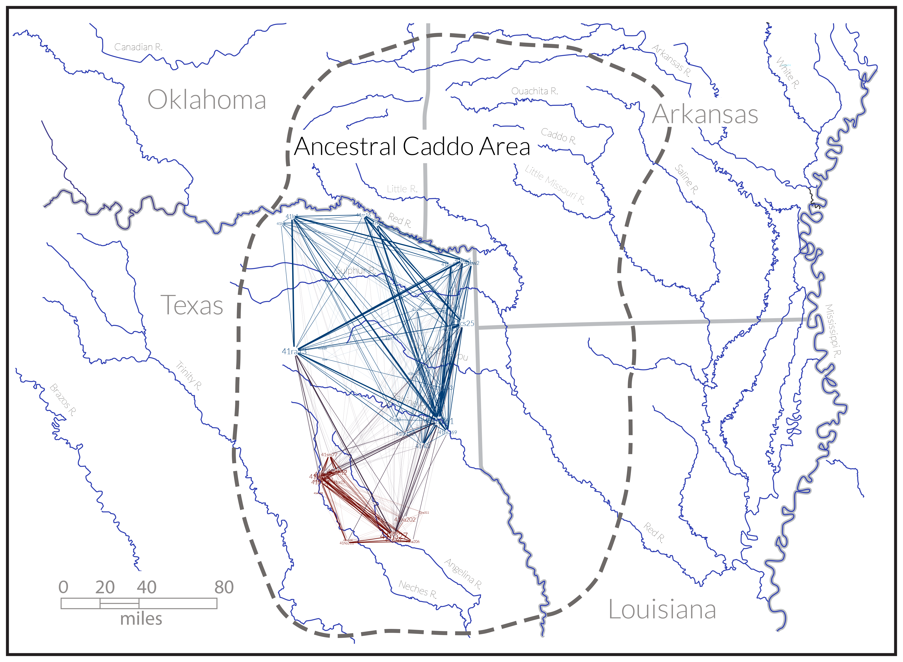

--- 
title: "Ceramic rim morphology differs significantly between contexts at the Carson site"
author: "Robert Z. Selden, Jr."
date: "`r Sys.Date()`"
site: bookdown::bookdown_site
documentclass: book
bibliography: [book.bib]
biblio-style: apalike
link-citations: yes
description: "Morphology of ceramic rims."
---

# Preface {-}

>Reproducibility---the ability to recompute results---and replicability---the chances other experimenters will achieve a consistent result---are two foundational characteristics of successful scientific research [@RN20918].

This volume is written using _Markdown_, and includes all analysis code employed in the study, providing a means for others to reproduce (exactly) those results discussed and expounded upon in the following chapters. The replicable nature of this undertaking provides a means for others to critically assess and evaluate the various analytical components of this study [@RN20915;@RN20916;@RN20917], which is a necessary requirement for the production of reliable knowledge.

## Basis of inquiry

In a June 18, 1937 Works Progress Administration interview with Lillian Cassaway, Sadie Bedoka---a Caddo-Delaware woman who was raised with the Caddo---stated that:

>Each [Caddo] clan had its own shape to make its pottery. One clan never thought of making anything the same pattern of another clan. **_You could tell who made the pottery by the shape_** [@RN9357x, 395].

### Caddo communities of practice 

General differences in Caddo ceramic forms have been noted elsewhere [@RN5650;@RN7129;@RN7162]; however, geometric morphometric methods provide a means of quantitatively assessing the morphological variation that occurs in Caddo ceramics. The study of the Clarence H. Webb collection was the first to illustrate a potentially significant north-south geographic shape difference among Hickory Engraved and Smithport Plain Caddo bottle types [@RN8370]. That preliminary observation was confirmed using more robust samples of Hickory Engraved and Smithport Plain bottles [@RN8074;@RN7927], and later expanded to include a greater variety of Caddo bottle types across a larger spatial extent [@RN8312].

Currently-employed Caddo phases and periods were defined using suites of co-present artefact types and attributes as a heuristic tool to explain the local cultural landscape, and the Historic Caddo network has expounded upon those efforts [@RN8031]. The networks built upon the previously defined phases and periods, emphasising the dynamic and manifold relational connections that transcend predetermined categories [@RN8031]. This was achieved through the use of a multi-scalar methodological approach [@RN5644;@RN8039], where the northern and southern communities were parsed into constituent groups using the same modularity statistic employed in defining the two (northern and southern) larger communities [@RN8051;@RN8024]. A number of the constituent groups identified by the networks were found to articulate with previously-identified Caddo polities, while others were not [@RN8031].

```{r fig.net, fig.cap="Historic Caddo network generated using ceramic and lithic types, which includes Caddo ceramics, illustrating two larger north (blue) and south (red) communities of practice. The communities were identified using a modularity statistic to identify nodes more densely connected to one another than to the rest of the network [@RN8051;@RN8024]."}

```

A subsequent analysis of Gahagan bifaces confirmed that a second category of Caddo material culture expressed significant morphological differences across the same geography as the Hickory Engraved and Smithport Plain bottles [@RN8158]. The morphology of Gahagan bifaces from sites in central Texas was later found to differ significantly when compared with those recovered from the ancestral Caddo area [@RN8322]. That Gahagan bifaces were found to differ across two spatial boundaries was noteworthy, particularly since it is regularly assumed that they were manufactured in central Texas and arrived in the ancestral Caddo area as products of trade or exchange [@RN8158;@RN8322]. Further, that Gahagan bifaces were found to differ across the same geographic area as the Hickory Engraved and Smithport Plain Caddo bottles suggested that the temporal range of the _shape boundary_ may extend into the Formative/Early Caddo period (CE 800 - 1250); a notion that was later confirmed in a more comprehensive analysis of Caddo bottles [@RN8312].

Perdiz arrow points represent a third category of Caddo material culture to be included in the analyses, and were among those artefact types included in the Historic Caddo network analysis [@RN8031]. While it was expected that they would differ across the _shape boundary_, it was not at all clear how that difference would be characterised. This is due primarily to the high degree of shape variation that occurs across the Perdiz type. It was less clear whether Caddo Perdiz arrow points might be said to differ by temporal period in the northern and southern communities of practice ([https://aksel-blaise.github.io/perdiz2/](https://aksel-blaise.github.io/perdiz2/)). A recent study found significant differences in shape by time, raw material, and burial context for Perdiz arrow points from the ancestral Caddo area [@RN9364], making clear the dynamic nature of their morphology.

This effort shifts the analytical focus to a smaller scale, providing a means of applying the tools of geometric morphometrics to the oft-fragmentary and incomplete elements of material culture regularly encountered in cultural resource management. The first of these studies is focusing upon variability in decorative motifs via Caddo ceramic incisions ([https://aksel-blaise.github.io/incision/](https://aksel-blaise.github.io/incision/)), and a shift to analyses of standard vessel components would provide an additional means of developing and testing our conceptual arguments related to the Caddo cultural landscape.

### Proof of concept

Using the figures and tables provided in a recent article published in [_Southeastern Archaeology_](https://doi.org/10.1080/0734578X.2021.1922072) [@RN9619], rim images and tabular data were repurposed for a study of traditional and geometric morphometrics to assess whether ceramic rim shape differs between two discrete contexts at the Carson site.

_**This document serves as proof of concept for a larger study related to ceramic rim morphology in the ancestral Caddo area of the American Southeast.**_

## Primary findings

**Traditional morphometrics**

* No variables differ significantly between contexts at the Carson site

**Geometric morphometrics**

* Rim shape _**differs significantly**_ between contexts at the Carson site

## Data management

The data and analysis code associated with this project can be accessed through this document or the GitHub repository [https://github.com/aksel-blaise/carson.rim](https://github.com/aksel-blaise/carson.rim), which is digitally curated on the Open Science Framework [DOI: 10.17605/OSF.IO/AE9ZM](https://osf.io/ae9zm/).

## Colophon

This version of the analysis was generated on `r Sys.time()` using the following computational environment and dependencies: 

```{r colophon, cache = FALSE}
# what R packages and versions were used?
if ("devtools" %in% installed.packages()) devtools::session_info()
```

Current Git commit details are:

```{r}
# where can I find this commit? 
if ("git2r" %in% installed.packages() & git2r::in_repository(path = ".")) git2r::repository(here::here())  
```
